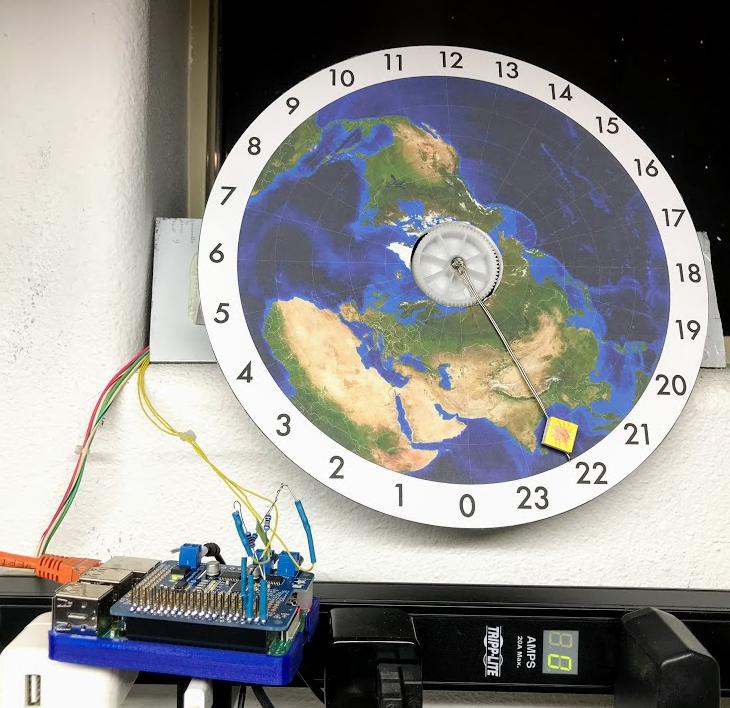

# stepper-clock

I recall seeing my first 24 hour clock at the [chemisty store](http://www.chem.umd.edu/resources/operationsandsafety/chemstores) at the University of Maryland around 2002/2003. When doing some research for a clock of my own I was inspired by this take: https://timhutton.github.io/2014/01/28/36976.html. Raspberry Pi, steppers and the like for the fun of it.

## bill of materials
- Raspberry Pi Model 3 B+
- Adafruit DC & Stepper Motor HAT - https://www.adafruit.com/product/2348
- IR photogate (from an old Xerox printer)
- NEMA 23 stepper motor w/15t GT2 pulley - from https://www.surplusgizmos.com/
- foamcore & aluminum for the structure
- GT2 timing belt and 3D printed 108t pulley to get 1440 steps / 24 hrs (1 step/min)

## implementation notes
Use chrontab to run the script every fifteen minutes to update clock position. Hour hand rotates until photo gate is tripped at the 'home' position (0:00), then hour hand steps to the current time at which point the stepper is released. This approach is taken so there is no current draw by the stepper during idle periods, while maintaining positioning accuracy. It also results in a kinetic sculpture of sorts and more motion than you get out of a regular clock.

## map image / clock face
Use NASA program, rotate so local longitude is at noon.
https://www.giss.nasa.gov/tools/gprojector/

## possible future upgrades / improvements
- leds or other way to indicate minutes / seconds if more accuracy is desired
- additional photogates to reduce stepper travel / homing routine
- rebuild / build enclosure and/or base for the works
- replace foamcore sun with an led that would show roughly where the sun is shining on the globe
- replace the 2D map with a 3D rotating globe and add a second stepper to tilt the axis of rotation with the seasons 
- update documentation with a quick electrical schematic
